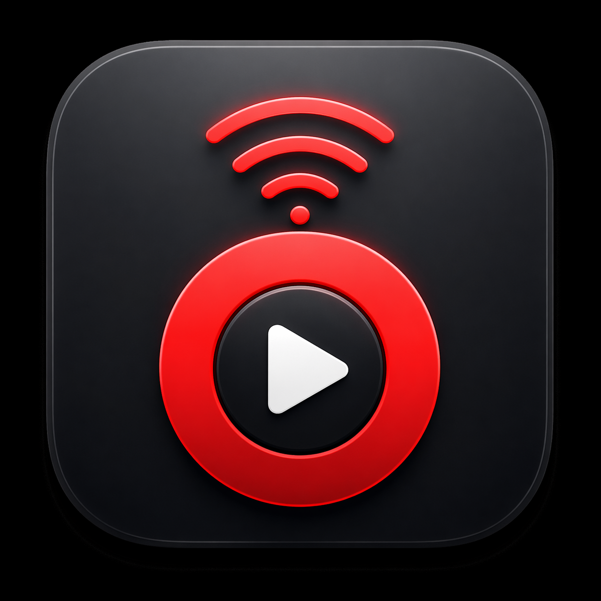

<div align="center">
  

# Pear YouTube Remote

A focused remote controller for YouTube Music running inside Pear Desktop.

[](https://www.electronjs.org/)
[](https://react.dev/)
[](https://vite.dev/)
[](https://www.typescriptlang.org/)
[](#install)
[](#license)


English · [한국어](README.ko.md)

</div>

## About

Pear YouTube Remote is a small Electron app for controlling YouTube Music running inside [Pear Desktop](https://github.com/pear-devs/pear-desktop) from another Linux or macOS machine.

It talks to Pear Desktop's `api-server` plugin over HTTP, so the actual music playback stays on the remote computer while this app acts as a focused controller: search, play, queue, seek, volume, likes, shuffle, repeat, and connection switching.

It is best treated as a companion app rather than a Pear Desktop plugin: Pear Desktop owns playback and exposes the API; Pear YouTube Remote stays outside as a lightweight controller that can run on a different machine.

## Positioning

Pear Desktop already provides the player, plugins, and `api-server`. This project adds a dedicated remote-control surface for desk setups where the playback machine is not the machine in front of you.

Good upstream PR candidates for Pear Desktop are API improvements such as lyrics exposure, remote-client documentation, volume state consistency, and typed queue/search responses. The full controller UI should stay here as a separate app unless Pear Desktop maintainers explicitly want a bundled remote companion.

## Preview

The UI follows the shape of YouTube Music/Pear Desktop without trying to be a full clone:

- remote servers live in the left sidebar
- search and connection status stay in the top bar
- now-playing artwork is centered
- the queue sits on the right
- transport controls stay fixed in the bottom player bar

## Features

- Multiple remote profiles with alias, API URL, bearer token, and active-server switching.
- Current track display with artwork, artist, elapsed time, duration, and playback state.
- Transport controls: play, pause, previous, next, relative seek, click-to-seek.
- Volume controls with live percentage tooltip and mute toggle.
- Search YouTube Music from the controller and play results immediately.
- Add search results to the remote queue.
- Queue viewer with thumbnails, jump-to-item, remove item, and clear queue.
- Like, dislike, shuffle, repeat, and fullscreen controls.
- Pear Desktop setup guide built into the Help dialog.
- Flat custom titlebar on Linux and native-friendly hidden titlebar on macOS.
- Linux and macOS packaging through `electron-builder`.

## Requirements

- Node.js 20 or newer
- npm
- Pear Desktop installed on the playback machine
- Pear Desktop `api-server` plugin enabled
- Network access from the controller machine to the remote Pear Desktop API port
- A bearer token if Pear Desktop uses the default `AUTH_AT_FIRST` API auth strategy

Default Pear Desktop API URL:

```text
http://127.0.0.1:26538
```

When controlling another machine, replace `127.0.0.1` with that machine's LAN IP:

```text
http://192.168.0.25:26538
```

## Quick Start

```bash
git clone https://github.com/Bae-ChangHyun/pear-youtube-remote.git
cd pear-youtube-remote
npm install
npm run dev:electron
```

Then open Settings and add a remote server:

```text
Alias: Studio Mac
API URL: http://192.168.0.25:26538
Token: optional, only when Pear Desktop auth is enabled
```

## Pear Desktop Setup

On the computer that will actually play music:

1. Install Pear Desktop.
2. Open Pear Desktop and enable the `api-server` plugin.
3. Confirm the API server host and port. Pear Desktop defaults to `0.0.0.0:26538` for the plugin.
4. If auth is enabled, approve the client and copy the returned bearer token. Pear Desktop defaults to `AUTH_AT_FIRST`.
5. Make sure the controller machine can reach the API URL over the network.

Common local test:

```bash
curl http://127.0.0.1:26538/api/v1/song
```

Common remote test:

```bash
curl http://REMOTE_IP:26538/api/v1/song
```

## Install

### Download

Pre-built installers are available on the [Releases](https://github.com/Bae-ChangHyun/pear-youtube-remote/releases) page:

| Platform | File |
| --- | --- |
| macOS (Apple Silicon) | `.dmg` / `.zip` |
| Linux | `.AppImage` / `.deb` |

### Development

```bash
npm install
npm run dev:electron
```

The dev server uses port `5187`.

If the port is already in use, stop the existing dev process first.

### Production Build

```bash
npm run dist
```

Build output is written to `release/`.

### Linux

Linux targets are configured for:

- AppImage
- deb

```bash
npm run dist
```

### macOS

macOS targets are configured for:

- dmg
- zip

```bash
npm run dist
```

Building macOS installers is most reliable on macOS.

> **macOS Gatekeeper warning**
>
> Because the app is not signed with an Apple Developer certificate, macOS will block it on first launch with a message like _"Apple cannot check it for malicious software."_
>
> To fix this, run the following command after installing:
>
> ```bash
> xattr -cr "/Applications/Pear YouTube Remote.app"
> ```
>
> Or go to **System Settings > Privacy & Security** and click **Open Anyway**.

## Scripts

| Command | Description |
| --- | --- |
| `npm run dev` | Start Vite renderer dev server |
| `npm run dev:electron` | Start Vite and Electron together |
| `npm run typecheck` | Run TypeScript checks |
| `npm run build` | Typecheck and build renderer assets |
| `npm run dist` | Build desktop installers with electron-builder |

## API Coverage

Pear YouTube Remote currently uses these Pear Desktop `api-server` surfaces:

- `GET /api/v1/song`
- `GET /api/v1/song-info`
- `GET /api/v1/queue`
- `GET /api/v1/queue/next`
- `POST /api/v1/search`
- `POST /api/v1/play`
- `POST /api/v1/pause`
- `POST /api/v1/previous`
- `POST /api/v1/next`
- `POST /api/v1/seek-to`
- `POST /api/v1/go-back`
- `POST /api/v1/go-forward`
- `GET /api/v1/volume`
- `POST /api/v1/volume`
- `POST /api/v1/toggle-mute`
- `GET /api/v1/like-state`
- `POST /api/v1/like`
- `POST /api/v1/dislike`
- `GET /api/v1/shuffle`
- `POST /api/v1/shuffle`
- `GET /api/v1/repeat-mode`
- `POST /api/v1/switch-repeat`
- `GET /api/v1/fullscreen`
- `POST /api/v1/fullscreen`

See [`docs/API_REFERENCE.md`](docs/API_REFERENCE.md) for implementation notes.

## Lyrics And Thumbnails

Thumbnails are supported when Pear Desktop exposes them through the current song, search, or queue renderer payloads.

Lyrics are not currently supported because the public Pear Desktop `api-server` routes used by this app do not expose a stable lyrics endpoint. Pear Desktop has a synced-lyrics plugin internally, so a clean future path would be an upstream API endpoint rather than scraping internal UI state.

## Architecture

```text
renderer React UI
      |
      | safe IPC bridge
      v
Electron preload
      |
      | ipcMain handlers
      v
Electron main process
      |
      | HTTP requests
      v
Pear Desktop api-server
```

The renderer never calls Pear Desktop directly. Electron main owns API requests and exposes a narrow IPC bridge through `src/preload/index.cjs`, avoiding browser CORS issues and keeping Node APIs out of the renderer process.

## Configuration

Settings are stored through Electron's app data directory and include:

- remote server list
- active server id
- alias per server
- base API URL per server
- optional bearer token
- polling interval

## Troubleshooting

### `Port 5187 is already in use`

Another Vite dev server is already running. Stop it before running:

```bash
npm run dev:electron
```

### Remote shows offline

Check:

- Pear Desktop is running on the playback machine.
- The `api-server` plugin is enabled.
- The IP address and port are correct.
- A firewall is not blocking the port.
- Auth token is present if Pear Desktop auth is enabled.

### Volume UI does not match system volume

Pear Desktop's YouTube Music volume is controlled separately from OS-level volume. Pear YouTube Remote controls the Pear/YouTube Music player volume exposed by `api-server`.

## Project Status

This project is early but usable. The core remote control loop is implemented; future work may include signed installers, automatic remote discovery, richer queue editing, and lyrics support if Pear Desktop exposes a stable lyrics API.

## Promotion

Recommended launch angle:

- "A remote controller for Pear Desktop when your music machine is across the room."
- Target Pear Desktop users first, not generic YouTube Music users.
- Share short clips or screenshots showing search, queue, and volume control from another laptop.
- Open issues upstream only for narrow API improvements; keep this repo focused on the companion app.
- Avoid implying official Google, YouTube, YouTube Music, or Pear Desktop endorsement.

## Contributing

Issues and pull requests are welcome.

Before submitting changes:

```bash
npm run typecheck
npm run build
```

Keep the app focused: this is a remote controller for Pear Desktop's YouTube Music API, not a full YouTube Music replacement.

## Author

Maintained by `chbae624@gmail.com`.

## Disclaimer

Pear YouTube Remote is an independent, unofficial companion app. It is not affiliated with, authorized by, endorsed by, or officially connected to Google LLC, YouTube, YouTube Music, Pear Desktop, or pear-devs.

The names "Google", "YouTube", "YouTube Music", and "Pear Desktop" are used only for identification and compatibility description. All trademarks belong to their respective owners.

## License

MIT
